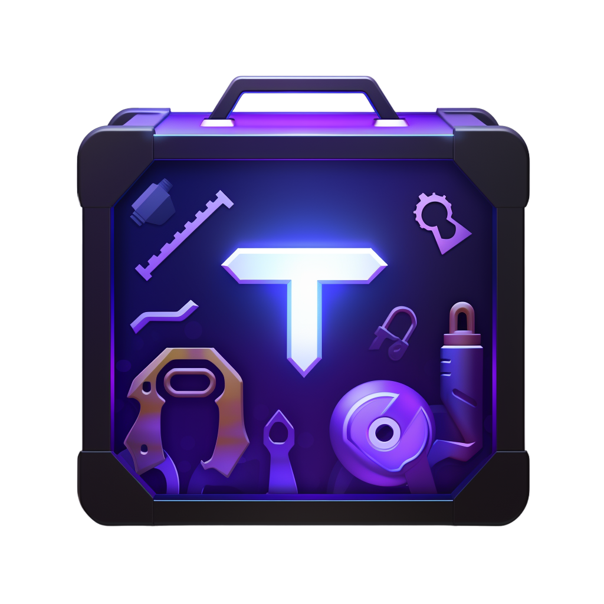
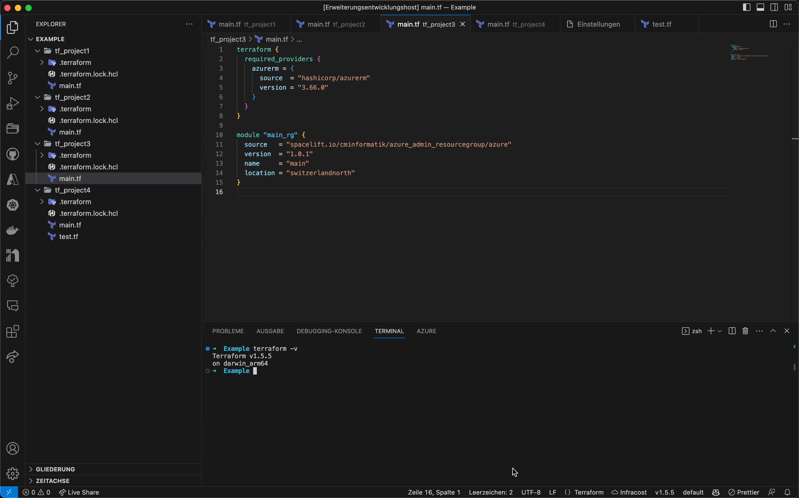
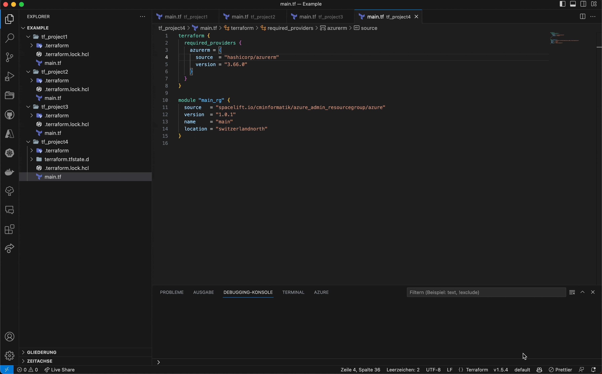
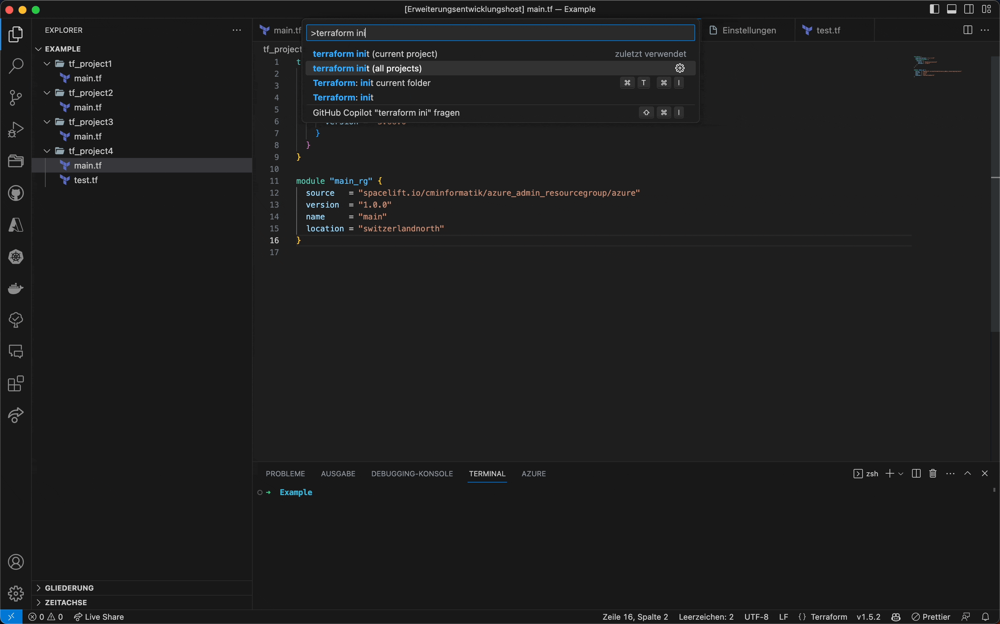
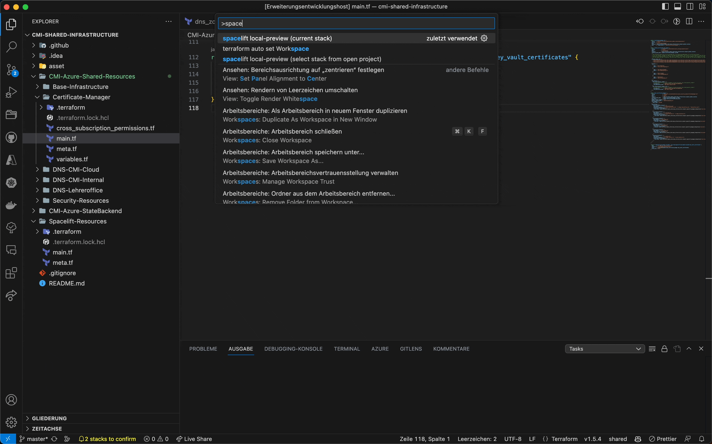
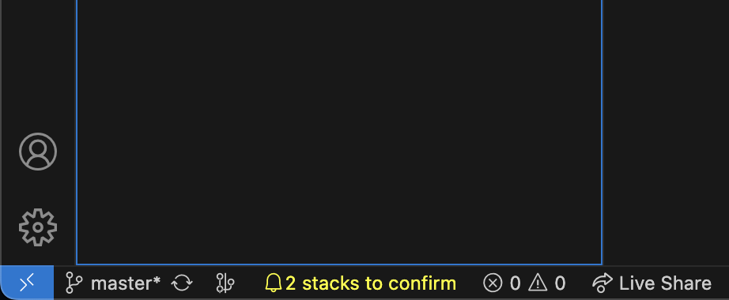

# Terraform-Toolbox VSCode Extension



VSCode extension adding a bunch of featurees regarding Terraform / OpenTofu and Spacelift.

- [Terraform-Toolbox VSCode Extension](#terraform-toolbox-vscode-extension)
  - [Motivation](#motivation)
  - [Getting startet](#getting-startet)
    - [Terraform / OpenTofu version manager](#terraform--opentofu-version-manager)
    - [Spacelift](#spacelift)
  - [Breaking changes](#breaking-changes)
    - [0.4.0](#040)
  - [Supported platforms](#supported-platforms)
  - [IaC Providers](#iac-providers)
  - [Features](#features)
    - [Terraform / OpenTofu version manager](#terraform--opentofu-version-manager-1)
    - [Terraform / OpenTofu workspace](#terraform--opentofu-workspace)
    - [Terraform / OpenTofu Init](#terraform--opentofu-init)
    - [Spacelift](#spacelift-1)
  - [Important Notes](#important-notes)

## Motivation

The main motivation behind building this extension was to improve the IaC workflow at my employer, [CMInformatik](https://www.cmiag.ch). The extension therefore contains some features that are specific to our workflow. However, I think that some of the features might be useful for other people as well. If you have any suggestions or ideas for improvements, feel free to open an issue or a pull request.

## Getting startet

The following features require manual configuration and installation steps:

### Terraform / OpenTofu version manager

The following requirements must be met for the version manager to work:

- Active Terraform or OpenTofu versions are stored in the following folder:
  - Windows: `%USERPROFILE%\.terraform-toolbox\active`
  - Mac: `$HOME/.terraform-toolbox/active`

This folder must be added to your path. Also, make sure that you have no other Terraform or OpenTofu binaries in your path.

### Spacelift

To use any spacelift feature of this extension, [spacectl](https://github.com/spacelift-io/spacectlhttps://github.com/spacect) has to be installed and available in your Path. You also have to set a userprofile in spacectl with the command:

```bash
spacectl profile login <profile_name>
```

When creating a new profile, make sure to select the option `Login with a web browser`. This will open a browser window, where you can log-in to your Spacelift account. This method makes sure that the token used by spacectl is the same as the one used by your Webbrowser. Since Spacelift recently changed its token validity (only 1 token per user is now allowed to be active), this is the only way to make sure that the extension gets an valid access token without revoking your web browsers Spacelift token. Once the token used by spacectl has expired or has been revoked, a status item will be shown. By clicking on the status item, you will be prompted to authenticate spacectl again with your browser.

Regarding spacelift, no authentication is required in VSCode. The extension uses the `spacectl profile export-token` command to get an api token for the current userprofile. This token is then used to authenticate the extension with spacelift.

If you don't want to use any spacelift features, you can simply not install the spacectl, this will disable all spacelift features of the extension.

## Breaking changes

### 0.4.0

- All settings with the pattern `tftoolbox.terraform.*` have been renamed to `tftoolbox.iac.*`.
- The setting `tftoolbox.spacelift.showNoTerraformVersionInstalledMsg` has been renamed to `tftoolbox.iac.showNoIacProviderVersionInstalledMsgOnStart`.

## Supported platforms

The extension supports all three major OS platforms:

- Windows (x64/x86/arm64)
- MacOS (x64/arm64)
- Linux (x64/x86/arm64) (not tested)

MacOS and Windows are regularly used and tested. Linux is not tested, but should work.

## IaC Providers

The extension supports both Terraform and OpenTofu as IaC providers. Terraform will be used per default. To switch to OpenTofu, you can set the `tftoolbox.iac.provider` setting to `opentofu`, this will switch the extension to OpenTofu mode.

## Features

### Terraform / OpenTofu version manager

This extension adds version managers for both Terraform and OpenTofu. They allow you to install and switch between any terraform or OpenTofu version available, including betas, alphas, and rc.

In case of Terraform, binaries are downloaded from `https://releases.hashicorp.com/terraform`. The active binary is stored in the following folder: `%USERPROFILE%\.terraform-toolbox/active` (Windows) or `$HOME/.terraform-toolbox/active` (Mac). Not active but installed versions are stored in `$HOME/.terraform-toolbox/terraform` (Mac) or `%USERPROFILE%\.terraform-toolbox\terraform` (Windows).

For OpenTofu, binaries are downloaded from the official OpenTofu Github releases page. The active binary is stored in the following folder: `%USERPROFILE%\.terraform-toolbox/active` (Windows) or `$HOME/.terraform-toolbox/active` (Mac). Not active but installed versions are stored in `$HOME/.terraform-toolbox/opentofu` (Mac) or `%USERPROFILE%\.terraform-toolbox\opentofu` (Windows).

- Command [`tftoolbox.setIacProviderVersion`]: Select and install a specific version for the active IaC Provider.
  
- Command [`tftoolbox.deleteIacProviderVersions`]: Evaluates the required version for all of your open projects and selects the latest version that matches all the requirements. With the setting `tftoolbox.iac.autoSelectVersion` you can enable to auto-select a version when opening VSCode. More information can be found here: [Auto set IaC Provider version](docs/autoSetIacVersion.md)
- Command [`tftoolbox.autoSetIacProviderVersion`]: Select and delete installed versions for the configured provider.
- StatusBarItem [`IacActiveVersionItem`]: Shows the active version for the configured IaC Provider in the status bar. Clicking on the status bar item opens the version manager.

The commands above manage versions for the configured IaC Provider. Additionally, the following commands are available to manage versions for Terraform and OpenTofu explicitly regardless of the current configuration:

| Command                    | Terraform                           | OpenTofu                           |
| -------------------------- | ----------------------------------- | ---------------------------------- |
| Select and install version | `tftoolbox.setTerraformVersion`     | `tftoolbox.setOpenTofuVersion`     |
| Delete installed versions  | `tftoolbox.deleteTerraformVersions` | `tftoolbox.deleteOpenTofuVersions` |
| Auto select version        | `tftoolbox.autoSetTerraformVersion` | `tftoolbox.autoSetOpenTofuVersion` |

### Terraform / OpenTofu workspace

Tired of switching between workspaces in the terminal? This extension adds a status bar item showing the currently active Terraform / OpenTofu workspace. By clicking on the status bar item, you can select and switch to a different workspace. The extension adds the following features regarding terraform workspaces:

- Command [`tftoolbox.setWorkspace`]: Select and switch to a terraform workspace in the current folder.
  
- Command [`tftoolbox.iac.autoSelectWorkspace`] Auto set the terraform workspace for all folders when opening vscode. Uses the workspace name from the `.terraform-toolbox.json` file in the root of the workspace. More information can be found here: [Workspace settings](docs/workspaceSettings.md)
- StatusBarItem [`IacActiveWorkspaceItem`]: Shows the currently selected workspace in the status bar if a Terraform / OpenTofu file is open. Clicking on the status bar item opens the workspace manager.

### Terraform / OpenTofu Init

Since the init command is required for many features of the official Hashicorp Terraform extension to work, this extension adds some features to make the terraform init process easier:

- Command [`tftoolbox.initCurrentProject`]: Run terraform / tofu init in the current folder. Similar to the init Command of the official Hashicorp Terraform extension, but it allows you to specify additional init arguments with the setting `tftoolbox.iac.initArg`.
- Command [`tftoolbox.initAllProjects`]: Finds all terraform folders in your open workspaces and runs terraform init in each of them asynchronically. With the setting `tftoolbox.iac.autoInitAllProjects` you can enable to auto init all folders when opening VSCode. More information can be found here: [Terraform init all projects](docs/initAllProjects.md)
  
- Command [`tftoolbox.initRefreshModules`]: Installs missing modules for the current folder.

### Spacelift

Spacelift is a Terraform CI/CD tool. They provide a cli-tool, called spacectl, that allows you to run proposed runs of your local terraform code on Spacelift. However, the cli requires you to specify the Spacelift stack-id and the working directory of the terraform-project, for which the proposed run should be created. To make this process easier, this extension adds two commands as wrapper around the spacectl:

- Command [`tftoolbox.spaceliftLocalPreviewCurrentStack`]: Run a local preview for the current folder. The stack-id is automatically evaluated based on the current Repository and Subfolder.
  
- Command [`tftoolbox.spaceliftLocalPreview`]: Run a local preview of a selected stack on Spacelift. You will be presented with a list of all stacks for the current workspace. The selected stack will be used to run the local preview.
- StatusBarItem [`StacksPendingConfirmationCount`]: Shows the number of stacks that have pending confirmation in the status bar. Clicking on the status bar item opens your Spacelift portal.
  

## Important Notes

This extension is still in early development. We are using it at CMInformatik for our daily work, but there might still be some bugs. If you find any bugs or have any suggestions for improvements, feel free to open an issue or a pull request.
